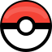
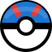
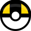
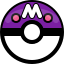
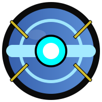

# pokemon-icons

A small collection of Pokémon-related icons and images (pokeballs and variants).

Repository layout
-----------------

- `pokeballs/` - directory containing various pokéball images

Included files
--------------

The collection:

-  `pokeballs/poke_ball.svg` — standard Poké Ball
-  `pokeballs/great_ball.svg` — Great Ball
-  `pokeballs/ultra_ball.svg` — Ultra Ball
-  `pokeballs/master_ball.svg` — Master Ball
-  `pokeballs/premier_ball.svg` — Premier Ball
-  `pokeballs/beast_ball.svg` — Beast Ball
    - Work in progress

Copyright
----------
©2025 Pokémon. ©1995–2025 Nintendo / Creatures Inc. / GAME FREAK inc. Pokémon and Pokémon character names are trademarks of Nintendo.
